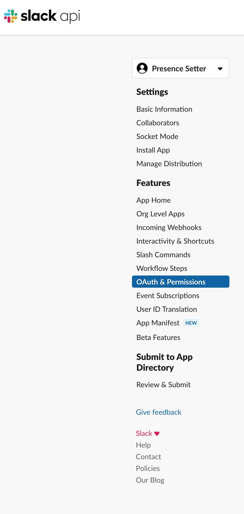

# Presence Setter

Presence setter is a quick and dirty lambda function that will change your presence in Slack on a schedule. Its the same as remembering to manually set your status to `away`.

## Prerequisites

You'll need;

- AWS Account
- Ability to create a Slack App
- Serverless installed

## Quick Tour

`serverless.yaml` is the definition of the infrastructure you want to deploy - this is going to be a Lambda function an and event bridge with 2 rules configured using cron.

Set the times you want to toggle the status and trigger the lambda.

`handler.py` is a quick and dirty lambda that will read the status of your Slack Presence and then change to either `auto` or `away` depending on the current setting. 

> Note: This is a bit blunt and will be refined to take into account the time etc to set the correct intended status.

## Using it

### Slack

Create a Slack App then you need to give the User Token the required scope - this is done going to `OAuth and Permission` 



and setting the `User Tokens Scope` to;

```
- dnd:read
- dnd:write
- users:write
- users:read
```

The `dnd:*` permissions allow the Do Not Disturb setting and ending and the `users:*` permissions allow for reading and updating your status

Install the app in your workspace and it's ready to go

### Serverless

I've not user Serverless before, more than anything else, this was an exercise in playing with it.

install the CLI

```bash
npm i -g serverless
```

### AWS

Create some credentials to deploy with, you're going to need them when running Serverless. Either do `aws configure` to set up `~/.aws/credentials` or export the creds to the shell env but you need them for `Serverless` to access.

Now you can run 

```bash
export SLACK_API_KEY=<provide your Slack token here>

serverless deploy
```

Which will create the Lambda function and the Event bridge...


## Testing it out

You can test the lambda using the aws cli

```bash
aws lambda invoke --function-name presence-setter-dev-function response.json
```

this should change your status and return with a `200`